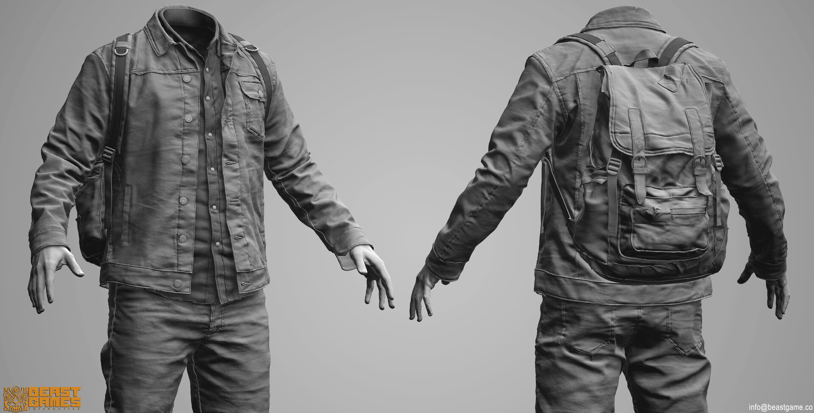
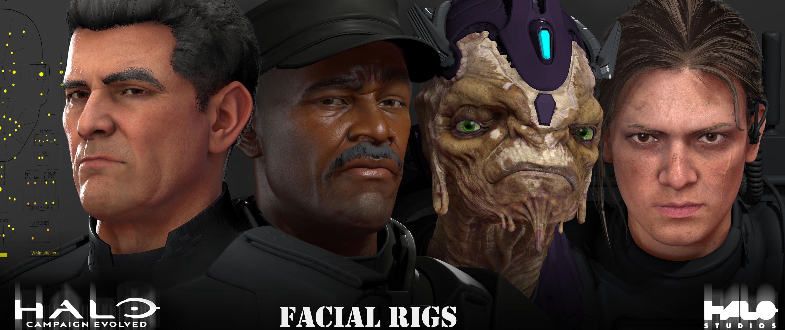
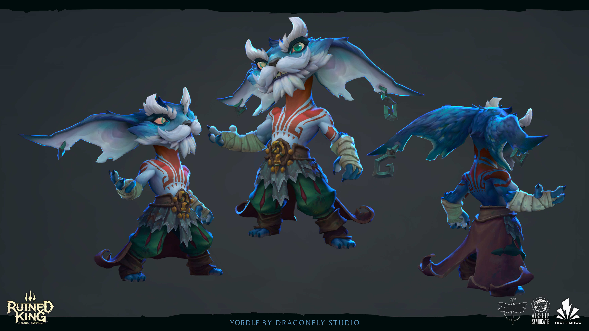
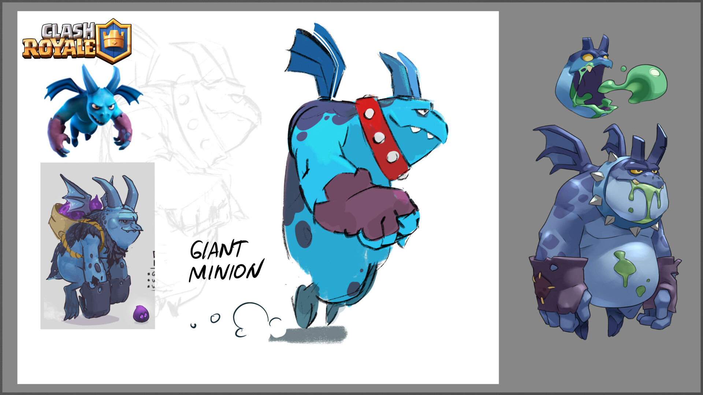
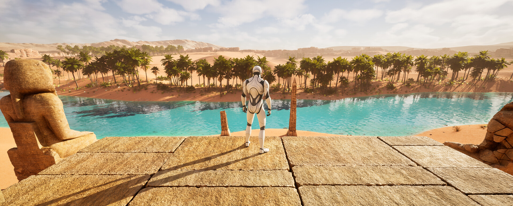
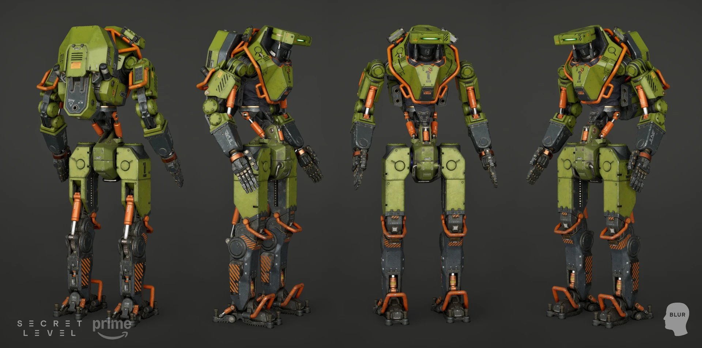

# Références 3D — Overnight Studio

Pour les visuels du site, utiliser en priorité les [28 prompts de Tanguy](../exports-gpt-image/PROMPTS-SITE-OVERNIGHT.md).
Les fichiers produits sont à ranger dans [exports-gpt-image](../exports-gpt-image/README.md).


Collection de références pour diriger les images de présentation de personnages, accessoires,
véhicules et environnements d'Overnight Studio.

## Prêt pour la prochaine image

**Donner un sujet, un mode et une contrainte suffit pour démarrer.**

- [Démarrage rapide](DEMARRAGE-RAPIDE.md) : brief court et préparation des images d’entrée.
- [Cinq prompts prêts à utiliser](PROMPTS-PRETS.md) : objet, mech, personnage, véhicule, environnement.
- [PROMPTS.json](PROMPTS.json) : mêmes prompts et références exactes, avec leurs rôles et empreintes.

Les références nécessaires à ces modèles sont accessibles individuellement. Les archives
complètes restent disponibles pour approfondir un projet. Ces modèles n’ont pas encore été
validés par génération.

## Contenu

**445 images conservées** : 10 fichiers déjà présents, plus 435 images dans des ZIP numérotés.
Les deux nouvelles archives couvrent **62 projets**. Deux fichiers de la première archive
sont aussi présents à l’identique dans `originaux.zip` ; le manifest distingue chemins et contenus.

- [`CONTEXTE-IMAGES-OVERNIGHT.md`](CONTEXTE-IMAGES-OVERNIGHT.md) : brief de Tanguy, intégral.
- [`images/uploaded/`](images/uploaded/) : 10 fichiers de `Ref 3D Image.zip`.
- [`ARTSTATION.md`](ARTSTATION.md) : 20 liens d’origine, dont **19 avec 196 images**.
- [`SIMILAIRES.md`](SIMILAIRES.md) : **43 projets et 239 images** supplémentaires.
- [`LECTURE-VISUELLE.md`](LECTURE-VISUELLE.md) : choix de caméra, lumière, matières,
  personnages et formats, avec exemples précis.
- [`manifest.json`](manifest.json) : provenance, dimensions, poids, empreintes et niveau de lecture.

Les archives numérotées contiennent les images originales sans modification de leurs octets.
Les planches d’aperçu sont des copies réduites destinées à la consultation. Les images ArtStation
ont été fournies par ZIP. **JwedwA reste la seule référence initiale sans images** ; `JwemvA`
est un autre projet. Les deux ne sont pas assimilés.

## Consulter et extraire

- [Catalogue PDF des planches](APERCUS.pdf) : 19 projets d’origine, 8 planches complémentaires et
  6 projets complémentaires détaillés.
- [Collection originaux](ARCHIVES.md#originaux) : 196 images de 19 projets.
- [Collection similaires](ARCHIVES.md#similaires) : 239 images de 43 projets.

Chaque collection est répartie en ZIP autonomes qui conservent les projets entiers.
Les ZIP dépassent la taille d’aperçu de nombreux lecteurs : utiliser **Download raw file**
sur GitHub, ou cloner la branche. Pour travailler avec Codex dans le dépôt :

```bash
python refs-3d/extract_references.py
```

Cette commande vérifie les empreintes et prépare `refs-3d/images/artstation/` et
`refs-3d/images/similaires/`. Elle ne remplace pas un fichier local différent. Les fichiers
extraits sont ignorés par Git : les ZIP restent les sources enregistrées. Les chemins `path`
du manifest désignent les fichiers après extraction. Les liens du guide ouvrent les aperçus.

## Sélection de départ selon le besoin

| Besoin | Références à ouvrir |
| --- | --- |
| Présentation complète d’un objet | [Mailbox Diorama](APERCUS.pdf#page=20), [Console](APERCUS.pdf#page=29) |
| Personnage, vêtements et matériaux | [Bird and Fish](APERCUS.pdf#page=3), [The Exorcist](APERCUS.pdf#page=33) |
| Personnage mécanique et gros plans | [Xan](APERCUS.pdf#page=2), [Solar Express](APERCUS.pdf#page=10) |
| Véhicule studio puis en contexte | [Nissan Taxi](APERCUS.pdf#page=11), [Thunderbolt](APERCUS.pdf#page=13) |
| Architecture et modules | [Last Call](APERCUS.pdf#page=16), [Clesseia](APERCUS.pdf#page=17) |
| Composition d’environnement | [Old Bones](APERCUS.pdf#page=32), [Sacred Tower](APERCUS.pdf#page=30) |
| Accessoire stylisé | [Cottage teapot oven](APERCUS.pdf#page=19), [Desert Treasures](APERCUS.pdf#page=18) |

## Index des images fournies

| Fichier | Rôle visuel |
| --- | --- |
| [beast-game-in-14.jpg](images/uploaded/beast-game-in-14.jpg) | Vêtement face/dos : couches, coutures, plis et volumes. |
| [beast-game-in-f.jpg](images/uploaded/beast-game-in-f.jpg) | Vêtement en présentation verticale : silhouette et lecture des matières. |
| [brx-shortt-romsfacialrigsthumbnail.jpg](images/uploaded/brx-shortt-romsfacialrigsthumbnail.jpg) | Visages : diversité des personnages et présentation de rig facial. |
| [dragonfly-studio-yordle-male-a-04-publish.jpg](images/uploaded/dragonfly-studio-yordle-male-a-04-publish.jpg) | Personnage stylisé : plusieurs angles, proportions et palette. |
| [mark-kistanov-8.jpg](images/uploaded/mark-kistanov-8.jpg) | Environnement : composition panoramique et profondeur du paysage. |
| [rodrigo-estero-miniongiant-concept.jpg](images/uploaded/rodrigo-estero-miniongiant-concept.jpg) | Personnage stylisé : recherche et traduction d'un concept. |
| [rodrigo-estero-miniongiant-lookdev.jpg](images/uploaded/rodrigo-estero-miniongiant-lookdev.jpg) | Personnage stylisé : comparaison de vues et développement des matières. |
| [rodrigo-estero-miniongiant-sculpt.jpg](images/uploaded/rodrigo-estero-miniongiant-sculpt.jpg) | Personnage stylisé : cohérence des vues et présentation des volumes. |
| [tom-tran-1.webp](images/uploaded/tom-tran-1.webp) | Robot mécanique : plusieurs vues, construction et répartition des matériaux. |
| [tom-tran-2.webp](images/uploaded/tom-tran-2.webp) | Robot mécanique : cadrage rapproché, articulations, peinture et usure. |

## Utilisation

1. Lire le brief de contexte avant de préparer une image.
2. Choisir les références utiles à la demande ; préciser le rôle de chacune
   (silhouette, pose, matières, lumière, cadrage ou présentation).
3. Décrire les caractéristiques à reprendre sans mélanger automatiquement tous les styles.
   Les personnages très stylisés sont des références optionnelles ; le brief garde son défaut
   réaliste PBR à légèrement stylisé.
4. Vérifier le rendu par rapport aux références sélectionnées et corriger les écarts ciblés.

Les observations proviennent des images effectivement parcourues ; le manifest précise la portée de cette lecture pour chaque projet.
Les noms de fichiers originaux ont été conservés pour préserver les indications de provenance.
Les identités des auteurs et les licences n'ont pas été vérifiées séparément pour les fichiers
du ZIP. Cette collection est une base d'étude, pas un portfolio de créations d'Overnight Studio.

## Aperçus

### Vêtements



### Visages



### Personnages stylisés





### Environnement



### Robot mécanique


